# readme-forge

Self-hosted, dependency-free, animated SVG cards for your GitHub profile README.
No third-party card service, no rate limits, no fees: a scheduled GitHub Action
renders the cards and commits them to your profile repo.

<p>
  
  
</p>
<p>
  
  
</p>


<sub>Rendered from built-in demo data (`npm run demo`).</sub>

## Cards

| card | what it shows |
|---|---|
| `stats` | stars, commits, PRs, issues, repos, contributed-to, a level ring, yearly contributions |
| `languages` | donut + legend of your languages by bytes, top N + "Other" |
| `streak` | current streak (with dates), longest streak, all-time contributions |
| `activity` | smooth area chart of the last N days with the peak highlighted |

Themes: `midnight` · `neon` · `dracula` · `ocean` · `light` · `auto` (follows the viewer's color scheme).

## Use it on your profile

1. In your profile repo (`<you>/<you>`), add [`examples/profile-workflow.yml`](examples/profile-workflow.yml)
   as `.github/workflows/readme-forge.yml`.
2. Optional, recommended: create a classic PAT with `read:user` and `repo` scopes and save it as the
   `README_FORGE_TOKEN` secret, so private contributions and languages count too.
3. Run the workflow once (Actions → readme-forge → Run workflow). Cards land in `readme-forge/`.
4. Reference them from your `README.md`. `<picture>` swaps the theme with GitHub's light/dark mode:

```html
<picture>
  <source media="(prefers-color-scheme: dark)" srcset="readme-forge/stats-midnight.svg">
  
</picture>
<picture>
  <source media="(prefers-color-scheme: dark)" srcset="readme-forge/streak-midnight.svg">
  
</picture>
<picture>
  <source media="(prefers-color-scheme: dark)" srcset="readme-forge/languages-midnight.svg">
  
</picture>
<picture>
  <source media="(prefers-color-scheme: dark)" srcset="readme-forge/activity-midnight.svg">
  
</picture>
```

### Action inputs

| input | default | |
|---|---|---|
| `token` | required | GitHub token (PAT for private data) |
| `user` | repo owner | username to render |
| `out` | `readme-forge` | output directory |
| `cards` | all | `stats,languages,streak,activity` |
| `themes` | `midnight,light` | one file per card × theme: `<card>-<theme>.svg` |
| `top` | `8` | languages shown |
| `exclude` | | languages to ignore, e.g. `Blade,HTML` |
| `days` | `60` | activity window |
| `hide_border` | `false` | |
| `animate` | `true` | CSS entrance animations (respects reduced motion) |
| `commit` | `true` | commit & push changed cards |

## Run locally

Requires Node ≥ 24 (runs TypeScript natively, no build step).

```bash
GITHUB_TOKEN=$(gh auth token) node src/cli.ts --user <you> --out out
```

```bash
npm run demo        # render demo cards into examples/
npm test            # unit + render tests
npm run typecheck
```

## Design

- `src/github` is the only I/O layer: it fetches the data and normalizes it into `ProfileData`.
- `src/stats` contains pure computations (streaks, languages, activity, level).
- `src/render` contains pure `(data, options) => svg` card renderers.
- `src/index.ts` exports `renderCard()`. Because it is pure, an HTTP mode (Vercel, Cloudflare,
  Dokploy) can wrap it directly; that's next on the roadmap.

## License

MIT
